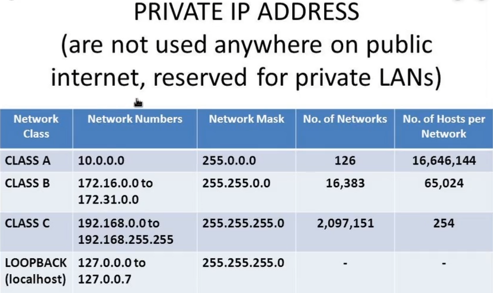

IP Address - (Layer 2)  
&ensp;	Private Ranges  
&ensp;&ensp;		

MAC Address (Media Access Control) (Layer 3)  
&ensp;	Hardware address burned into device  
&ensp;&ensp;		xx:xx:xx:xx:xx:xx:xx:xx (format)  
&ensp;&ensp;		first 6 (3 pairs) are identifiers  

TCP/UDP/3 way handshake (Layer 4)  
&ensp;	UDP - sends without waiting for a response on if the packet has been received  
&ensp;	TCP - relies on confirmation that the packet was received or not (will resend packet)  
&ensp;&ensp;		3-Way Handshake  
&ensp;&ensp;&ensp;			SYN > SYN ACK > ACK  