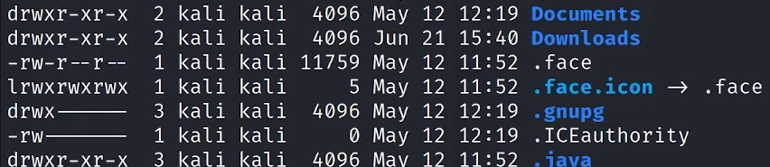
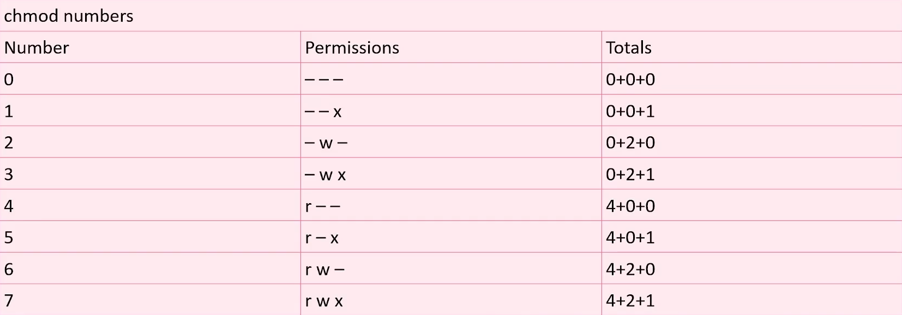

| ----------1---------|    |2|   |---3---|  |---4---|     |----5----|  |--6--|    |7|   |----8----|   |------------------9---------------|

1:  first char is declaration of filetype.  d is for directory, l is for link, - is a file.  
	next 9 characters are actually for 3 different groups (owner, group membership, all other users)  
	rwx stands for Read Write Execute.  If there is a - in one of those fields, it means that group does not have permission for that.  
	ex.   the .face above is a file, the owner has read and write but not execute, both group members and other users only have read access on this file.  
&ensp;&ensp;		`chmod +rwx test.txt`   this will give test.txt full read write execute privileges.  use r w x individually to set those permissions only.  
&ensp;&ensp;		`chmod 777 test.txt`    this will set all permissions for all users and groups  

The above is how those numbers work.  Each number in the command connects to the same order as the permissions.  The first 7 is for the file owner, the second 7 is for group members, the last 7 is for all other users.  So, 644 would be rw-r--r--.  

###### User Management
&ensp;	`sudo adduser Chris`   will add a user name Chris  
&ensp;	`passwd`      this will prompt you to change your password for whichever account you are logged in on.  
&ensp;	`sudo cat /etc/sudoers`   will show you the sudoers file  
&ensp;	`sudo deluser Chris`    will remove the user Chris  