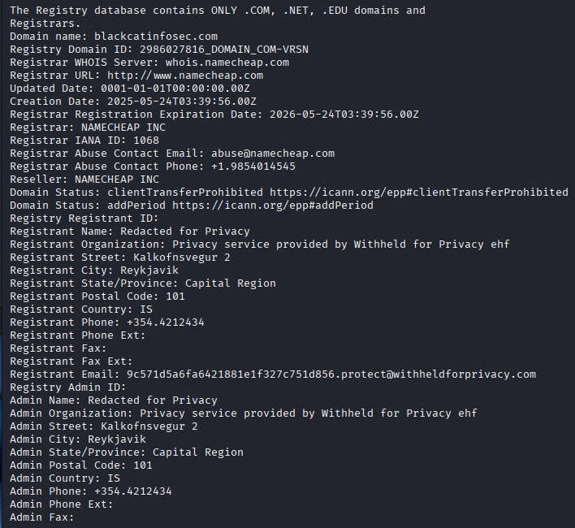

### Whois

Whois uses port 43 in order to query a nameserver (the server responsible for converting urls into ip addresses) for some information regarding a said website.  You can also use a specified name server with the `-h` command.

```
$ whois blackcatinfosec.com
   Domain Name: BLACKCATINFOSEC.COM
   Registry Domain ID: 2986027816_DOMAIN_COM-VRSN
   Registrar WHOIS Server: whois.namecheap.com
   Registrar URL: http://www.namecheap.com
   Updated Date: 2025-05-24T03:39:59Z
   Creation Date: 2025-05-24T03:39:56Z
   Registry Expiry Date: 2026-05-24T03:39:56Z
   Registrar: NameCheap, Inc.
   Registrar IANA ID: 1068
   Registrar Abuse Contact Email: abuse@namecheap.com
   Registrar Abuse Contact Phone: +1.6613102107
   Domain Status: clientTransferProhibited https://icann.org/epp#clientTransferProhibited
   Name Server: DNS1.REGISTRAR-SERVERS.COM
   Name Server: DNS2.REGISTRAR-SERVERS.COM
   DNSSEC: unsigned
   URL of the ICANN Whois Inaccuracy Complaint Form: https://www.icann.org/wicf/
>>> Last update of whois database: 2025-09-30T02:29:34Z <<<
```

This is a sample lookup on a random url.  Appears this has some privacy to it.  You also get some other information in your lookup.



