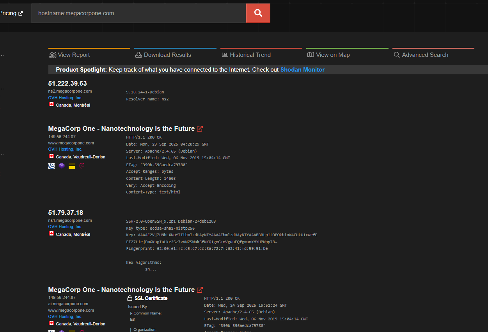

### Shodan

Shodan is a search engine for devices connected to the internet.  Shodan crawls the devices and gathers information from banners on the devices.

`hostname:megacorpone.com`

A sample search query.  This is a pretty powerful tool that can give a lot of information.  You can get services running on devices, versions of those services, the IPs of those servers, etc.

