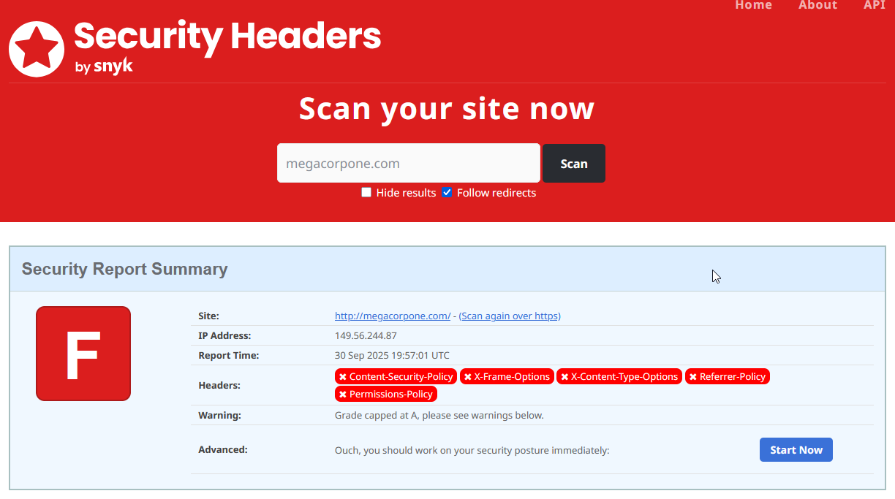

### Security Headers and SSL/TLS

Websites like `https://securityheaders.com/` can analyze HTTP response headers and give an idea of a targets security posture.  With this we can have an idea of an organization's coding and security practices.  While some of the items that are found are not vulnerabilities outright by themselves, it may speak to the level of security posture the site and the organization have as a whole.  A finding like the following could indicate that there may be a large number of things to find with this company.

Another useful site, `https://www.ssllabs.com/ssltest/`, gathers information on a site SSL and TLS settings.  This, like the tool before it, can return some good information.  If there are a number of weak SSL and TLS settings, it could, again, speak to a larger area of concern which is that this company may not following many security best practices.