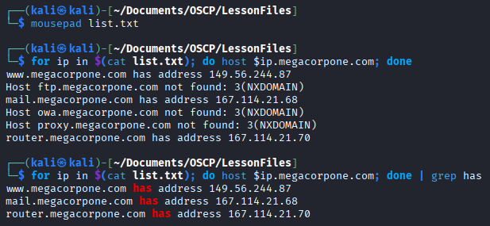
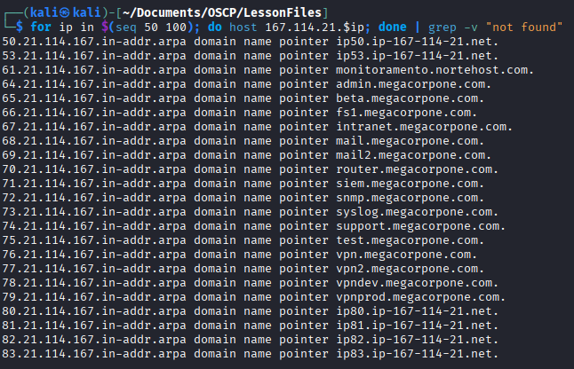

### DNS Enumeration

Domain Name System (DNS)

#### DNS record types:

NS - Nameserver records contain the name of the authoritative servers hosting the DNS records for a domain.  
A - Contains the IPv4 address of a given domain name.  Also called "host record" or "a record".  
AAAA - Same as A record but is the IPv6 version.  
MX - Mail Exchange record contains the name of the servers reponsible for handling email for the domain.  There can be multiples of this for a single domain.  
PTR - Pointer Records are used in reverse lookup zones and can find records associated with an IP address.  
CNAME - Canonical Name records are used to create aliases for other host records (A or AAAA).  
TXT - These text records contain other arbitrary data and can be used for various purposes such as verifing domain ownership.  

`host www.domain.com` - this will return the ip addy of a domain name.  By default it searches for the A record but many options can give you different information.

This gathering of IPs from urls is called `forward lookups`.

We can use this along with some bash in order to automate this process for a list of common hostnames.

Here we use a list of common hostnames to run through and check.  After getting a couple, I even ran mine through grep just to get ones that did have a successful hit.  In a larger number of items, this can reduce clutter.

`for ip in $(cat list.txt); do host $ip.megacorpone.com; done | grep has`

2 of the 3 that were found in the short list have the IP range, 167.1114.21.x.  We can use that as well to do a `revese lookup` and search that /24 subnet of IPs to see if they hold other megacorpone hosts.  Since we got .68 and .70 here, going to reverse lookup between 50 and 100.

`for ip in $(seq 50 100); do host 167.114.21.$ip; done | grep -v "not found"`

There are some tools that automate this process as well.  For manual workings though, we would iterate though this back and forth with forward and reverse lookups based on any information gathered in the previous step.  `DNSRecon` and `DNSEnum` are two such tools.

In some Living of the Land instances, you can also use `nslookup` within windows.