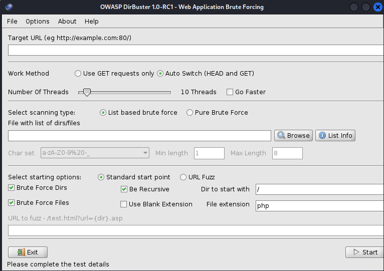

### Enumerating HTTP and HTTPS

Visit the site.  Maybe use Burpe Suite to gather some info that way.  Seeing port 80 and 443 

If you get a default setup page.  This is an automatic finding.  Informational but can be indicative of other items.  Are there other default settings?  Are they even hosting a webpage or are the ports open for no reason?

Viewing source code could also yield some interesting results.

`nikto` is a web vulnerability scanner.  Some good secured websites may block `nikto` scans but that is not always the case.

&ensp;	`sudo nikto -h http://<web server>`

This is how the basic command runs.  `-h` is for 'host'.

`dirbuster` and `dirb` as well as `gobuster`  
&ensp;	Any could be used, this course focused on `dirbuster`  
&ensp;&ensp;		running the command is as follows:  
&ensp;&ensp;&ensp;			`dirbuster&` - again the `&` is only to free up the CLI as this will run in a GUI  

Syntax is important with this tool.  It will want the `:80` at the end of the ip/webaddy as shown in the example in the GUI.  
File list is usually found in `/usr/share/wordlists/dirbuster/`  
File extension could fit what webserver you are looking at.  Apache is likely to run php while IIS is likely to run asp or aspx files.  
&ensp;	you can also included .txt, .rar, .zip, .pdf, etc - This will increase the search time though since it will run through these files extensions with the word list (i.e. admin.php, admin.txt, admin.rar, etc)  

You can also use Burp Suite to gather information as well.  
&ensp;	You can use Proxy to grab all the traffic to and from the website.  
&ensp;	You can send packets to repeater to modify and send packets to see what the responses would be.  
&ensp;	You can use Scope to limit your results  
