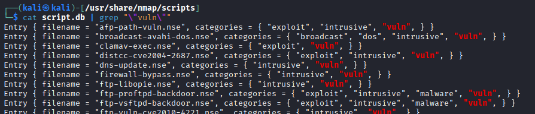
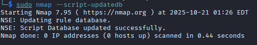

### NMAP Scripting Engine

`sudo nmap --script http-enum -p 80,5985,8000 192.168.144.192`

You can use NSE to do a lightweight vulnerability scan.

As mentioned before, the NSE scripts can be found in `/usr/share/nmap/scripts/` directory.  There is also a `script.db` file that serves as an index to all the currently available NSE scripts.  You can also use `cat` and `grep` to search for specific types.

`cd /usr/share/nmap/scripts/`  
`cat script.db | grep "\"vuln\""` - will search for the "vuln" keyword.

`sudo nmap -sV -p 443 --script "vuln" 192.168.126.13`

#### Manual Add of NSE script

There will be times when you need to add a new script to the list, perhaps from github or another source.

There are a couple different ways but you'll need to get the file into `/usr/share/nmap/scripts/` directory.  I created mine in that folder in mousepad with `sudo mousepad /usr/share/nmap/scripts/vulnname.nse`.  There is an obvious naming convention, try to follow it (it just looks cleaner and better).

Once you do that, you need to update the db.

`sudo nmap --script-updatedb`

At this point you can use the NSE script you just added to the library.  Happy scanning :D