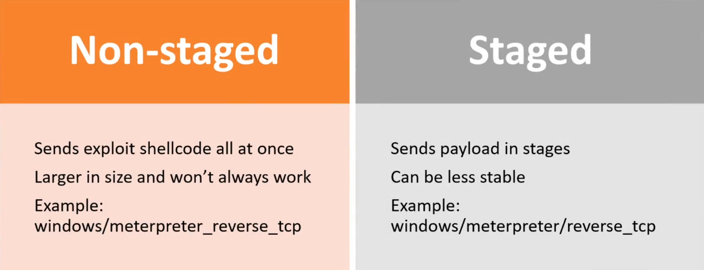

### Staged vs Non-Staged Payloads

Payload is what is run as the exploit on the target machine.

If you have a payload that does not work, try the other type (staged or non-staged).  Keep trying different payloads until one works if you're sure you have the correct payload.