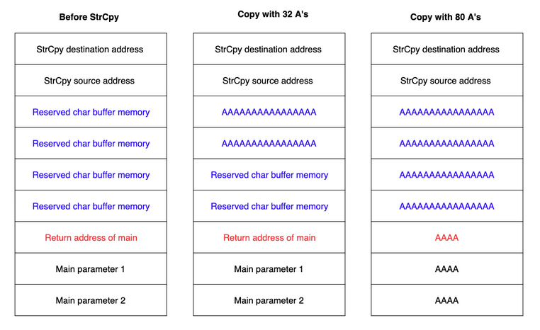
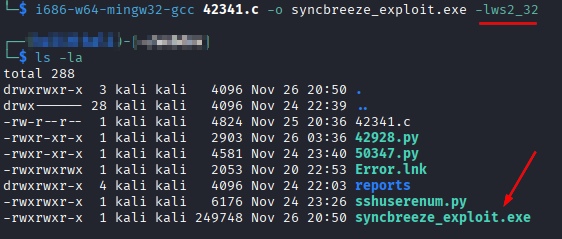

### Buffer Overflow

Sometimes you'll find a manual exploit for a vulnerability but it's not quite what you need.  You may need to adjust for things like version numbers of different software in a buffer overflow attack.

A `buffer` is an area of memory that is set aside to hold content, usually supplied by the user, to be processed later.  Some have a dynamic size while others have a specific set size.

To overflow that, you need to supply more data than the memory alocated can hold.  For example, if you have an input field that is set to only hold 8 characters, that 9th character is going to overflow the allotted memory and if the program doesn't handle that extra stuff correctly, it have some interesting consequences.

These memory corruption vulnerabilities occur in different parts of a program called `heap` or `stack`.  The `heap` stores large globally accessible chunks and is often dynamic.  The `stack` on the other hand is fixed and it deals more with storing local functions data.

Because the `stack` is normally a fixed size, it would seem a larger number of those are higher probability targets.  For example, this snippet of code is in C code but it declares a buffer size of 64 characters and then puts the user's data into that buffer.

```
*buffer[64]*
...
strcpy(buffer, argv[1]);
```

This takes the input from `argv` and copies that string into the buffer.  `strcpy(<destination>, <source>)`.  The one above doesn't have a check to make sure the buffer size is enough to hold whatever is in `argv[1]`.  If this input is more than the 64 characters the program is expecting and has memory set aside for, it could overwrite the return address which is appended to the end of of whatever input was going to memory.

Once a function ends, it executes the `ret` instruction to return.  This loads the return address inside the EIP/RIP, the instruction pointer responsible for keeping track of the current code instructions.  If you can manipulate the return address, you can point it to something else entirely and get that code to be the next thing to run and can even let us control the entire program flow eventually.



The left column here represents before any attack.  The middle column is 32 "A"'s.  And the final column is with 80 "A"'s.  You can see how the "A"'s fill everything up pretty quickly.

The letter "A" in hexidecimal is "41".  So in this case the return address is going to be overwritten to `\x41\x41\x41\x41`.  Instead though, we would usually map that bit to a mapped memory address that gives us control of the system in some way or another.  Typically it's a JMP ESP instruction pointing in the stack to the injected shellcode injected right after the beginning of the payload.

Depending on various things, we may need to adjust the payload to make sure things line up the way they need to.  You have to put the overflow payload in the right spot or it won't cause the system to call to the right location.

We could trust the exploit has the correct return address in the correct memory location but we should try to find it ourselves.  One of the best ways to do this is to clone the target locally and then run a debugger on the vulnerable software and obtain the return address instruction.

Since payloads are often encoded in hex, we often have to reverse engineer it to see how it functions.  Because of this we must either review the payloads at all times or simply insert our own.  When doing this, we include our own info (ip addy, port numbers, etc) and exclude any 'bad characters'.

Bad characters are ASCII or UNICODE characters that break an application when included into the payload because they could get interpreted as `control characters`.  The null byte `\x00` is one such instance.  It could stop the payload prematurely since it's often a string terminator.

#### Cross Compiling Exploit Code

Sometimes you may need to compile code that isn't a scripting language.  Compiling can is normally best done on a native system that is being compiled for (i.e. compile Windows programs on Windows).  However, that's not always possible.  In those cases, we use a linux tool called `mingw-w64`.

`sudo apt install mingw-w64`

So once that installs, we then try to use it.


It errors out.  After a quick google search on the errors, we see that we can add `-lws2_32` to the command and that should fix the problem.

`i686-w64-mingw32-gcc 42341.c -o syncbreeze_exploit.exe -lws2_32`



Now we have the .exe file compiled.

#### Adjusting Exploits for Use

