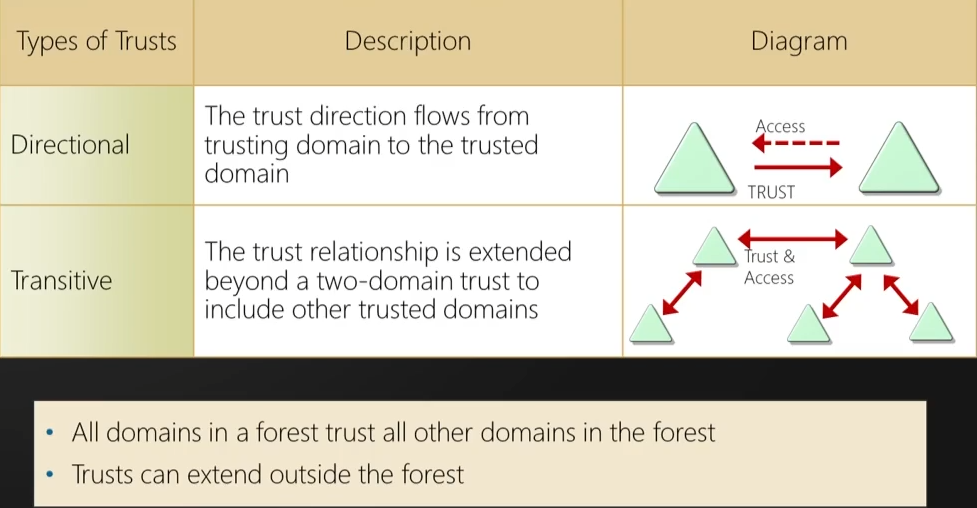
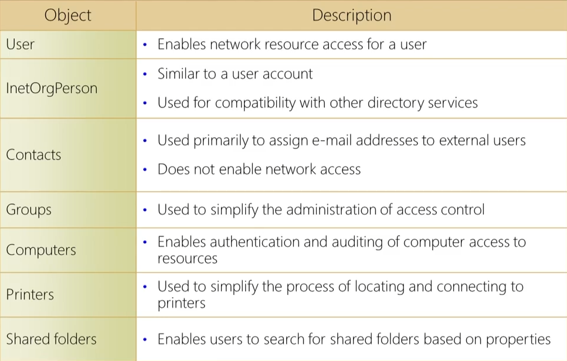

### Overview for AD Initial Attack Vectors  

Internal Pen Testing (done from the inside, once its compromised)  

Very common.  Will be rare if you do not run into AD on any sort of assessment.  

Stores information on Objects (computers, users, groups, policies, etc)  

Components of AD include  
&ensp;	Pysical  
&ensp;&ensp;		Data Store  
&ensp;&ensp;&ensp;			Contains the database files and processes that store and manage directory information for users, services, and applications  
&ensp;&ensp;&ensp;			Consists of the NTDS.dit file  
&ensp;&ensp;&ensp;			Stored in %SystemRoot%\NTDS folder on all DCs by default  
&ensp;&ensp;&ensp;			Accessible only through the domain controller processes and protocols  
&ensp;&ensp;		Domain Controllers  
&ensp;&ensp;&ensp;			Is a server within the network that controls most of the AD functions  
&ensp;&ensp;&ensp;			Has been specifically promoted to Domain Controller  
&ensp;&ensp;&ensp;			Host a copy of the AD DS directory store  
&ensp;&ensp;&ensp;			Provides authentication and authorization services  
&ensp;&ensp;&ensp;			Replicate updates to other DCs in the domain and forest  
&ensp;&ensp;&ensp;			Allow admin access to manage users accounts and network resources  
&ensp;&ensp;		Global Catalog server  
&ensp;&ensp;		Read-Only Domain Controller (RODC)  
&ensp;	Logical  
&ensp;&ensp;		AD DS Schema  
&ensp;&ensp;&ensp;			Defines every type of object that can be stored in the directory  
&ensp;&ensp;&ensp;			Enforces rules regarding object creation and configuration  
&ensp;&ensp;&ensp;&ensp;				Object types  
&ensp;&ensp;&ensp;					Class Object - What objects can be created (user, computer)  
&ensp;&ensp;&ensp;					Attribute Object - Info that can be attached to an Object (display name)  
&ensp;&ensp;		Domain  
	&ensp;&ensp;&ensp;		Used to group and manage objects in an organization  
&ensp;&ensp;&ensp;&ensp;				Administrative boundary for applying policies to groups of objects  
&ensp;&ensp;&ensp;&ensp;				Replication boundary for replicating data between DCs  
&ensp;&ensp;&ensp;&ensp;				Authentication and authorization boundary that provides a way to limit scope of access to resources  
&ensp;&ensp;		Trees  
&ensp;&ensp;&ensp;			A domain Tree is a hierarchy of domains in AD DS (contoso.com (parent), emea.contoso.com (child), na.contoso.com (child))  
&ensp;&ensp;&ensp;&ensp;				All domains in a Tree:  
&ensp;&ensp;&ensp;					Share contiguous namespace with parent domain  
&ensp;&ensp;&ensp;					Can have child domains  
&ensp;&ensp;&ensp;					By default creates a two-way transitive trust with other domains  
&ensp;&ensp;		Forests  
&ensp;&ensp;&ensp;			A forest is a collection of one or more domain trees  
&ensp;&ensp;&ensp;				Share a common schema  
&ensp;&ensp;&ensp;				Share a common configuration partition  
&ensp;&ensp;&ensp;				Share a common global catalog to enable searching  
&ensp;&ensp;&ensp;				Enable trusts between all domains in the forest  
&ensp;&ensp;&ensp;				Share the Enterprise Admins and Schema Admins groups  
&ensp;&ensp;		Organization Units (OUs)  
&ensp;&ensp;&ensp;			AD Containers that contain users, groups, computers, and other OUs  
&ensp;&ensp;&ensp;				Represent your organization hierarchically and logically  
&ensp;&ensp;&ensp;				Manage a collection of objects in a consistent way  
&ensp;&ensp;&ensp;				Delegate permissions to administer groups of objects  
&ensp;&ensp;&ensp;				Apply policies  
&ensp;&ensp;		Trusts  
&ensp;&ensp;&ensp;			Provide a mechanism for users to gain access to resources in another domain  
&ensp;&ensp;&ensp;&ensp;				Directional - flows from trusting domain to the trusted domain  
&ensp;&ensp;&ensp;&ensp;				Transitive - extended beyond a two-domain trust to include other trusted domains  
  
&ensp;		Objects  
&ensp;&ensp;			Everything within AD  
&ensp;&ensp;&ensp;				Users, groups, computers, printers, shared folders, contacts, InetOrgPerson  
  
