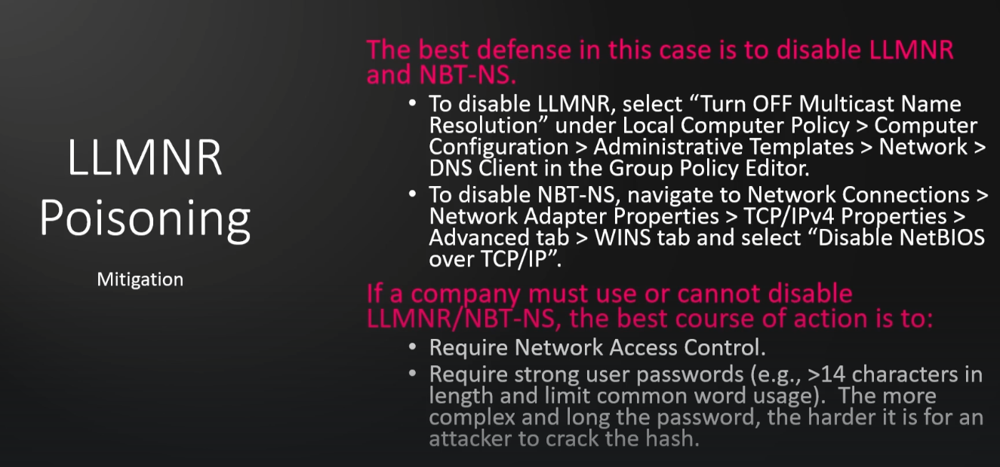

### LLMNR Poisoning

Link Local Multicast Name Resolution  
Identifies host when DNS fails to do so  
Previously NBT-NS  

Responder  
&ensp;	`sudo responder -I eth0 -dP`  
&ensp;	This will start responder on Interface eth0 with the tags of:  
&ensp;&ensp;		-d  enables answers for dhcp broadcasts  
&ensp;&ensp;		-w  Start the WPAD rogue proxy server (d and w can not run together)  
&ensp;&ensp;		-P  Force NTLM/Basic authentication for proxy (Works very well)  
&ensp;&ensp;		-v  Not listed here but will skip over already found hashes that would be skipped if already found  
&ensp;	Once you start to get hashes, you can use hashcat to crack your harvested hashes  

Mitigation  
  
