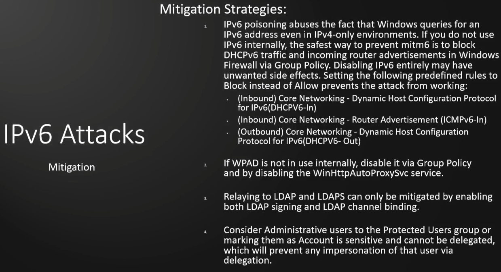

### IPv6 Attacks

IPv4 DNS is setup and being used but IPv6 is usually turned on but nothing is really set up with DNS and other services.  This may allow you to take advantage and allow you to get AD access.

`ntlmrelayx.py -6 -t ldaps://10.0.0.35 -wh fakewpad.marvel.local -l lootme`  
&ensp;	This will utilize IPv6 `-6` on the target domain controller (`-t ldaps://10.0.0.35`).  -wh for wpad and call it whatever like a subdomain on the local domain.  -l is where to put your "loot" and name it whatever.

Once that runs with no errors, now you'll run your mitm6 command  
&ensp;	`sudo mitm6 -d marvel.local`  
&ensp;&ensp;		-d is for domain with the domain after that  

When the `mitm6` command is run, this will start acting as a DNS for IPv6 enabling us to set ourselves as the 'man in the middle' for IPv6 traffic.  This will now listen for events (someone logged in or a computer restart) we will take that event and relay it to the DC.  

When that happens, you will start to get info dumped into a folder called "lootme" (or whatever you said to dump it into).  Lots of good info to have here.  

This should only be run for 5-10 minutes at a time as this can cause network outages.  

If an Admin logs in, this will create a user for us.  We'll need to find it in the output but at this point we can DCSync using secretsdump.py and the created user.  

Mitigation for this  
  

