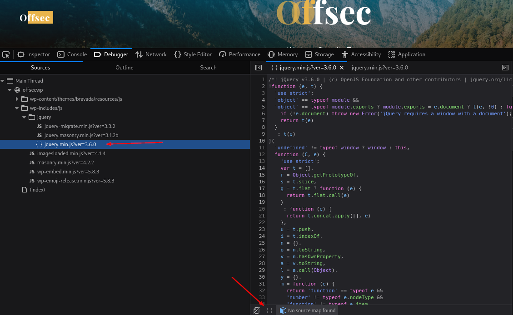
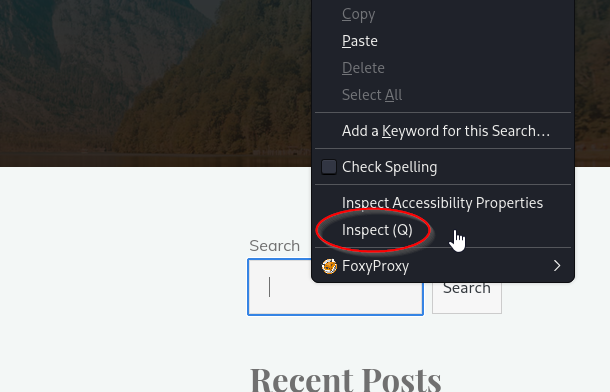
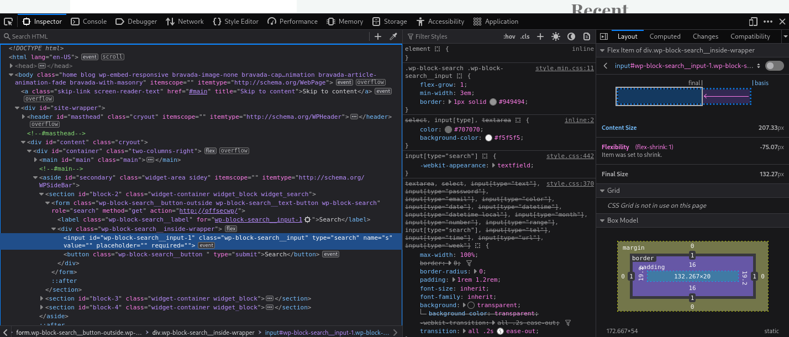

### Browser Dev Tools  (Ctrl + Shft + i (Firefox))

In the Debugger menu, you can break down different scripts and code.  You can use the backets at the bottom of the page to clean up any code found and make it more readable.

Here we see the code section on the left side and the curely brackets at the bottom.  That lets us see the code in this more readable format.

There is also the `Inspect` option when we right click on something.

When we select this option, get the the following

This allows us to inspect that specific part of the page.  This can help us find hidden form fields and other things on the page.