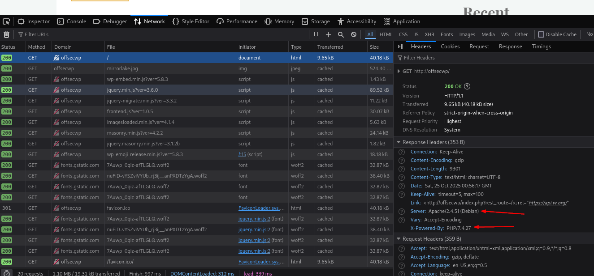

### Inspecting HTTP Headers and Sitemaps

In the network tab of those dev tools, you can often find, in the response header, the version of the server running the page as well as some other information.

HTTP headers are not always generated solely by the web server. For instance, web proxies actively insert the X-Forwarded-For header to signal the web server about the original client IP address.

X- headers were called non-standard.  These have been depricated but you may still see them.

You can also get a lot of this information with Burpsuite as well.

#### Sitemaps

Sitemap files are included to help search engine bots to "crawl" sites.  The `robots.txt` file indicates what sites NOT to be crawled while `sitemaps` give a listing of things in the site, usually in XML format.

Like the `robots.txt` file, `sitemap` can simply be appended to the end of the URL, `www.somewhere.com/sitemap.xml`