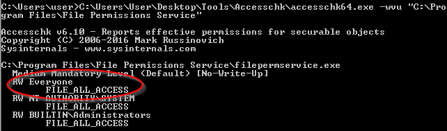
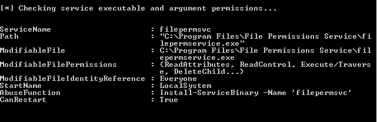
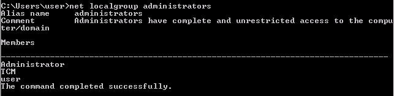

### Executable Files

Sometimes services have executable files tied to them.  If we are able to manipulate that executable file then we can compromise that service.

Running the following command will produce the output.  Again, these tools are part of sysinternals tools that you will need to obtain.

`C:\Users\User\Desktop\Tools\Accesschk\accesschk64.exe -wvu "C:\Program Files\File Permissions Service"`

Notice that everyone has RW FILE_ALL_ACCESS.  This can be exploited.

Pretty much the same way we did the last one.  Slight change and this one worked but instead of using ftp to download the new file, I served it up via http and this time when I tried the exploit, it worked.

You can also find this exploit with Powerup.sh1.

Used the same file as before but this time, replaced the filepermsvc with the one listed under Path here.  The restart the service and that gives us our account in administrators.

