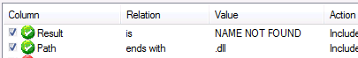
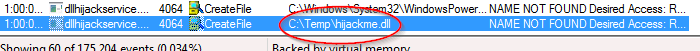

### DLL Hijacking

With DLL hijacking, you are going to look for two things.  We use procmon.exe to do this.

First, we need to find a dll that is trying to load and has a 'NAME NOT FOUND' when it attempts to load.

Second, we need to see if that dll is in a writeable folder.  If it is, we can hijack that dll by modifying it to do what we want.

Here, we use procmon to check for those criteria.

After opening procmon, click on the 'filter' button (or ctrl+L) to open that.

Search for conditions:

Result is NAME NOT FOUND
Path ends with .dll

Notice here that we have a dll in the Temp folder.

So we can use FTP here again to get the file.  Use gedit to modify said file to whatever we need it to be, then use python http server to download it to the victim machine.

Once that's done and the .dll is put in the directory where it couldn't be found before, then once the service restarts, whatever command you dropped in will be executed and there you go.