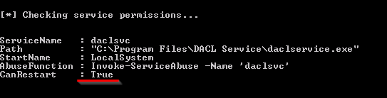
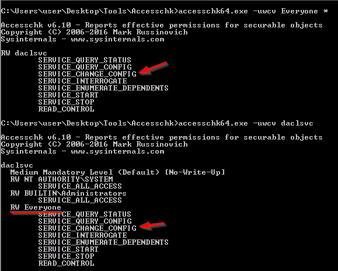
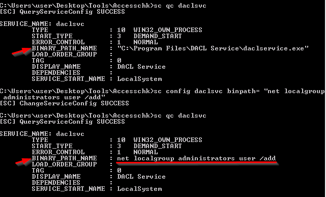
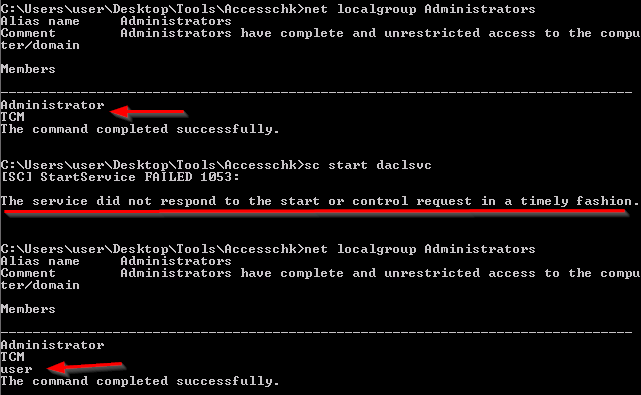
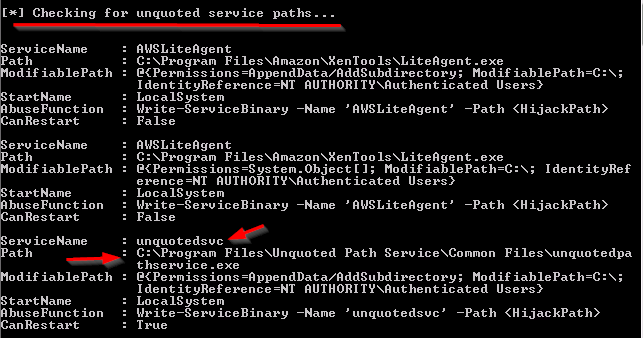
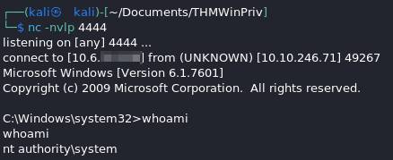

### Service Permissions

#### binPath

Binary path, or `binpath`, this is another check in PowerUp.ps1.  You would run it the same way here.

```
powershell -ep bypass
. .\PowerUp.ps1
Invoke-AllChecks
```

That will be shown in the following output



The big part here is that the fact that we can restart it is true.

You can also use access check

`accesschk64.exe -uwcv Everyone *`

And if you find anything interesting, dig further with access check as well

`accesschk64.exe -uwcv <servicename>`   - switch out the servicename for the name of the service you want more info on.
&ensp;-u  -This is used to suppress errors, showing only things that come back with only the positive findings.
&ensp;-w  - Only show items that have write access.  Things that we can modify.
&ensp;-c  - Says to display the service name for any found services
&ensp;-v  - is out good old buddy, verbose :)
&ensp;&ensp;The `Everyone *` runs that check on the EVERYONE group against all services (`*`)



Here, we can see that everyone has RW access on this service to change the config.

Now we're going to query the service, change a settting, and drop ourselves (`user`) into the Admins group.

```
sc query <servicename>
sc config <servicename> binpath= "net localgroup administrators user /add"
sc start <servicename>
```



Then when we start the service, here daclsvc, we get the following change.



Here, we notice that the first time we check the Admin group, user is not there.  The second time we check after starting the service, user is in the Admin group.  You'll also notice that you get an error when trying to start the service.  That is because the filepath that was there before was swapped out to our command so the exe was not there to start the service.

#### Unquoted Service Path

What you're looking for here is a service path that is not in quotes and has a space in it.  Windows will try to run a file if the service path is not quoted and there is a space.  For example...

C:\Windows\Start Menu\Programs  - Windows will try to run C:\Windows\Start.exe before it moves on to the Start Menu and so on.  If you can drop a file named start.exe in the Windows folder, windows will run it if the file path is not in quotes in the service path field.



In real life we would likely report all of these.  Here we're just focused on the `unquotedsvc`.

Here, we're going to create a payload with msfvenom to connect to a netcat session.

The only change is we change the payload from  
&ensp;`windows/meterpreter/reverse_tcp`  
&ensp;to  
&ensp;`windows/shell_reverse_tcp`  - actually had to try a couple different payloads here to get this to work.  But this one finally did it.  

Keep all the rest of the options the same and use netcat instead of metasploit and start up your nc listener and then start the service on the victim machine.



And now we have a NT AUTHORITY\SYSTEM shell :)
